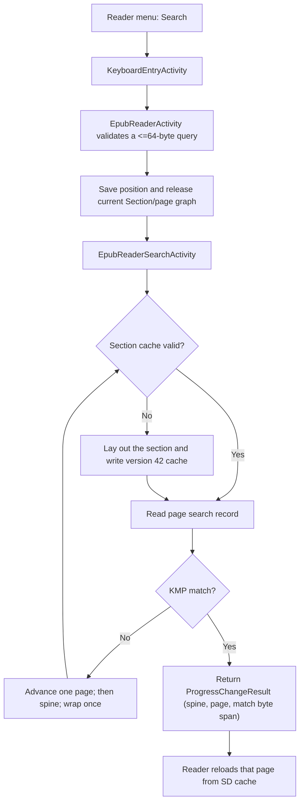

# In-Book Search Architecture

In-book search is implemented for EPUBs as a forward scan over compact text
records stored beside the rendered pages in each section cache. It deliberately
does not build a whole-book index in RAM. This design keeps the steady search
path bounded on the ESP32-C3 while preserving an exact `(spine, page)` target
for reader navigation.

## Goals and constraints

The implementation is optimized for the constraints shared by the X3 and X4:

- about 380 KB of usable RAM and no PSRAM
- one statically allocated monochrome framebuffer, sized for the larger X3
  buffer: 52,272 bytes for 792 × 528, compared with 48,000 bytes for the X4's
  800 × 480 panel
- a single-core ESP32-C3
- SD storage that is much larger than RAM, but slower and subject to write wear
- EPUB content that is laid out lazily, one spine section at a time

X3 support uses the same firmware image rather than a separate search build.
`HalGPIO` detects the device before `HalDisplay` initializes the panel, and
`GfxRenderer` then imports the runtime width, height, row width, and buffer size.
Search UI geometry comes from `UITheme` and those runtime renderer dimensions;
the keyboard and button hints already contain X3-specific spacing. Search input
uses `MappedInputManager`, so it follows the configured logical front-button
mapping on both devices.

The rendered viewport width and height are part of the section-cache validation
key. Consequently, a cache laid out for the X4 is rejected and rebuilt when the
same SD card and book are opened on an X3, and vice versa. This prevents the
search result's page number from being calculated against the other panel's
pagination.

The user-visible behavior is intentionally narrow:

- queries are limited to 64 UTF-8 bytes
- search starts at the current rendered page and moves forward
- after reaching the end of the spine, it continues through later spines
- after reaching the end of the book, it wraps once and stops at the page the
  search was initiated from
- the first matching page is returned immediately
- repeating the same query from the page returned by search starts at the next
  page, and the wrap stops before that originating page, so "find next" advances
  to a different match or reports no matches rather than re-returning it
- while searching, the status screen shows an approximate percentage of how much
  of the scan has completed, measured from where the search began (so it rises
  from 0% to 100% over the whole scan even when the search starts mid-book)

The result is page-granular. The reader opens the matching page and highlights
the matched words on the page.

## Component flow



The responsibilities are split as follows:

- `EpubReaderMenuActivity` exposes the existing translated `Search` command.
- `EpubReaderActivity` owns query history and coordinates the keyboard, search
  activity, reader position, and result highlighting.
- `SearchHighlighter` encapsulates the transient on-page text highlighting logic.
  It is a pure consumer of the byte span the scan reports for the matched page:
  it maps that span to the page's words and paints them, without re-running the
  matcher, re-normalizing text, or re-reading the cache, so it holds no buffers.
- `EpubReaderSearchActivity` is a small state machine whose `scanNextPage()`
  scan loop scans a bounded chunk of up to 50 pages per main-loop iteration
  before yielding, and distinguishes `Searching`, `NotFound`, and `Error`.
- `Page::serializeSearchText()` writes compact searchable text while the page
  already exists during layout.
- `Section::scanForward()` scans page text records without deserializing a
  `Page` or allocating word vectors.

All SD access continues through `HalStorage` and `HalFile`; search does not
reach into SdFat directly.

Implementation entry points:

- reader orchestration: [`EpubReaderActivity.cpp`](../src/activities/reader/EpubReaderActivity.cpp)
- on-page highlighting: [`SearchHighlighter.cpp`](../src/activities/reader/SearchHighlighter.cpp)
- cooperative scan activity: [`EpubReaderSearchActivity.cpp`](../src/activities/reader/EpubReaderSearchActivity.cpp)
- cache creation: [`Section.cpp`](../lib/Epub/Epub/Section.cpp)
- forward scan over the cache: [`SectionSearch.cpp`](../lib/Epub/Epub/SectionSearch.cpp) (`Section::scanForward`/`ensureSearchHeader`, split out of `Section.cpp`)
- per-page text serialization: [`PageSearch.cpp`](../lib/Epub/Epub/PageSearch.cpp) (`Page::serializeSearchText`, split out of `Page.cpp`)
- shared on-disk cache layout constants: [`SectionCacheFormat.h`](../lib/Epub/Epub/SectionCacheFormat.h)

## Section cache format

The search capability is fully integrated into the version 42 section cache format. Each serialized page is immediately followed by one search record:

```text
Page
u32 searchTextLength
u8  searchText[searchTextLength]
```

The on-disk page LUT stores two offsets per page — an 8-byte stride
(`PAGE_LUT_ENTRY_SIZE`):

```text
u32 pageOffset
u32 searchTextOffset
```

`pageOffset` preserves normal rendering behavior. `searchTextOffset` lets the
matcher seek directly to the bounded text record without decoding page
elements, images, footnotes, styles, or word-position vectors. (The paragraph
and list-item indices the reader uses for position restore are written to
separate LUTs, not this one.)

The text record contains the rendered page's words in page-element order,
joined by single ASCII spaces. Images and styling metadata are excluded. The
SD cost is therefore approximately one additional copy of rendered UTF-8 text,
plus 8 bytes per page: the record's 4-byte length prefix and the 4-byte
`searchTextOffset` added to each page LUT entry.

Additionally, version 42 stores all layout settings (including fonts, line compression, extra paragraph spacing, forced indents, paragraph alignment, bionic reading, guide reading, and the selected `EpubRenderMode`) in the section header. This ensures that the search-time layout accurately matches the reader's layout settings, preventing pagination misalignment. Version 42 invalidates older section caches automatically; they are rebuilt on demand using the normal cache-busting path. The book's EPUB source is never modified.

## Memory budget

The steady page-scan path has fixed memory use:

| Item | Storage | Size | Lifetime |
| --- | --- | ---: | --- |
| Saved query | Inline reader and activity arrays | 65 bytes each | Reader / search activity |
| SD read buffer | Stack | 64 bytes | One page scan |
| Search matcher (KMP pattern + prefix table, plus per-codepoint match-width tracking) | Inline in the activity | 544 bytes | Search activity |
| Search activity object (includes two matchers: the live one and a corrupt-cache rollback snapshot) | Heap, nothrow | 1,544 bytes | Search activity |
| Page LUT reservation | Heap | 12,288 bytes | Uncached section layout only |

The display's 52,272-byte framebuffer is not a search allocation. The shared
firmware reserves that X3-sized array statically even while running on an X4,
so entering search does not create a panel-sized heap allocation or change the
framebuffer footprint. Search uses the existing black-and-white framebuffer and
does not request a grayscale scratch buffer.

The search activity owns one reusable `Section`. `Section::resetForSpine()`
changes its spine and cache path in place, avoiding a new/delete cycle for each
chapter. Before the activity is allocated, the reader releases its current
`Section` and deserialized page graph. This avoids keeping the normal reader
working set and the search working set live together. Result highlighting is
delegated to `SearchHighlighter`, which is stateless: the scan reports the
matched byte span, and the highlighter maps it to words at render time, so it
needs no buffers of its own.

The 12,288-byte LUT reservation is not a new steady-state index. Section layout
already needs a data-dependent page LUT; reserving 1,024 entries once avoids
repeated allocate-copy-free growth. Chapters larger than that remain supported
and may grow the vector.

The search feature adds no static RAM: a `default` build measured 102,516 bytes
of static RAM both with the feature and on its pre-search base (`main`). Flash
grew by about 14,084 bytes in that same comparison (6,344,661 to 6,358,745
bytes) for the search behavior, cache handling, on-page highlighting, UI, and
translated strings. These are build snapshots rather than permanent budgets;
remeasure them when the implementation or toolchain changes.

## Matching algorithm

`Section::scanForward()` uses Knuth-Morris-Pratt matching because it:

- scans the SD record once
- handles matches that cross 64-byte read-buffer boundaries
- handles overlapping prefixes without rewinding the file
- needs only a prefix table bounded by the 64-byte query limit

ASCII `A-Z` bytes are folded to lowercase during comparison without copying the
query or page. The matcher also performs lightweight diacritic stripping and multi-character
folding (e.g., `ß` to `ss`, `æ` to `ae`, `é` to `e`) for Latin characters and common
typographic ligatures. This is implemented as a sequence of packed logic gates in instruction
flash, requiring zero RAM overhead. Rendered EPUB words are already NFC-composed by the layout
pipeline. General full-Unicode normalization is not performed.

Hyphens are insignificant on both sides, but spaces are significant. Hyphens are
dropped from the query (the KMP prefix table is built over that normalized form)
and skipped in the record, so a hyphenated word matches its unhyphenated query —
both a hard hyphen (`"mother-in-law"` matches `"motherinlaw"`) and a layout
line-break hyphen, which is stored as `"<frag>-"` plus a space plus `"<frag>"`.
Spaces, by contrast, are matched: a query without a space cannot run two words
together, so it can no longer start in the middle of one word and end in the
middle of the next (`"heran"` does not match `"the rang"`). The one exception is
a space immediately following a hyphen — the separator a line-break hyphenation
leaves between the two halves — which is dropped so the halves rejoin
(`"international"` matches the stored `"inter- national"`). Runs of spaces collapse
and leading/trailing spaces are trimmed so query spacing lines up with the
single-space record.

Matches are whole-word: a hit must be delimited by non-word characters on both
sides, where a word character is `[a-z0-9]` after folding and everything else
(spaces, punctuation, the record's edges) is a boundary. So `"cat"` no longer
matches inside `"category"` or `"scat"`, but it still matches `"the cat"`,
`"(cat)"`, and `"cat."`. The boundary is only enforced on an edge that is itself
a word character, mirroring a regex `\b`, so a query like `"etc."` is not forced
to sit before a non-word character. Because the trailing boundary can only be
seen on the character *after* a match, a completed match is held as tentative
until the next significant character (a word char rejects it, a boundary
confirms it) or until the record ends — the record stores whole space-separated
words with no trailing separator, so its end is itself a word boundary unless a
line-break hyphen carries the final word onto the next page. Dropped characters
(hyphens, unmapped codepoints) stay transparent for boundary purposes, so the
hyphenation-aware joins above are unaffected.

Codepoints with no ASCII or Latin folding (CJK, Cyrillic, Greek, unmapped
symbols, etc.) normalize to nothing and are dropped on **both** sides, like
hyphens. So `"a你b"` is treated as `"ab"` on the query side and the page side
alike, and a search for `"ab"` will match it. This is the same fuzzy class as the
hyphen bridging above, not a separate behavior, and it is intentional rather than
a missing boundary check. The needle is an ASCII-only
`uint8_t` array, so an unsupported codepoint can never appear *in* a pattern;
treating it as a hard boundary instead of dropping it would not make `"a你b"`
matchable — it would only stop the text `"a你b"` from matching its own exact
query, regressing search over any non-Latin book. Dropping is therefore the
least-surprising option available within the ASCII-needle constraint.

The matcher's KMP partial-match length is carried across consecutive pages of
the same spine, so a query split across a *page* boundary still matches — for
example a word the layout hyphenated at the foot of one page (`"…inter-"`) and
continued at the top of the next (`"national…"`), or any phrase that straddles
the break. Because the record stores no separator between pages, the scan feeds
an explicit word-boundary space before each page's content; this makes a page
boundary behave like an in-page word boundary (a spaceless query cannot run two
pages' words together) while still letting a page-final line-break hyphen rejoin
its continuation (the space after the hyphen is dropped). The injected space is
not part of the record, so it is not counted in the reported match offsets. The
carried state is reset at every reading-order discontinuity (a spine/chapter
change, the single wrap, and any image-only page with an empty text record), so
it never bridges non-contiguous text. A cross-page match is reported on the page
where it *completes* (the second page), which is where the reader opens.

The return type is `Section::ScanResult`, a `Section::ScanStatus` plus a `page`
index and the match's byte span (all valid only on `Match`):

- `ScanStatus::Match`: a match was found; `page` holds the page index.
- `ScanStatus::NoMatch`: the requested range was scanned (or was empty) with no
  match. The cache is valid.
- `ScanStatus::CorruptCache`: structurally invalid cache data (bad LUT offset,
  truncated record, etc.). A rebuild may repair it.
- `ScanStatus::IoError`: a seek/open failure or OOM. Rebuilding will not help.

This three-way distinction lets an ordinary `NoMatch` advance to the next page
while a failure moves the activity to its translated error state, and — crucially
— it separates *repairable* cache corruption from *transient* I/O failures so the
caller does not delete a valid cache over a momentary glitch. On the first
`CorruptCache` in a spine, the activity closes and removes that section cache,
rebuilds it, restores the matcher state from the start of the failed page, and
retries once; a second `CorruptCache` removes the cache again and surfaces the
error rather than entering an unbounded rebuild loop. An `IoError` is surfaced
without deleting the cache, since a rebuild cannot fix it.

### Alternatives considered

The decisive constraints are the streaming read model and the RAM budget, not
raw matching speed. The page text is read from SD byte by byte regardless, so
the scan is I/O-bound: an algorithm that skips *comparisons* does not skip
*reads*, which is where the time goes. Each alternative was rejected against
those constraints rather than against asymptotic complexity.

- **Naive / sliding window.** Correct in practice for short page text, but it
  needs an overlap buffer to span 64-byte read boundaries and can rewind on a
  mismatch (worst case O(n·m)). KMP gives the same streaming behavior with a
  guaranteed linear bound and no rewind for no extra cost.
- **Boyer–Moore / Horspool.** Sublinear by skipping ahead on mismatches, but it
  skips comparisons, not SD reads, so the I/O cost — the actual bottleneck — is
  unchanged. Its bad-character table is 256 bytes, which is the entire
  documented local-data budget on its own, and right-to-left window scanning
  with variable forward jumps fits poorly with a 64-byte streaming chunk reader.
  More RAM and complexity for no I/O win.
- **Rabin–Karp.** A rolling hash is also single-pass, tiny-memory, and handles
  chunk boundaries, but it adds a collision-verification fallback for no
  advantage over KMP's deterministic O(n).
- **`std::search` / `std::boyer_moore_searcher`.** Both want random-access
  iterators over the full text, so the whole record would have to be buffered in
  RAM, defeating the streaming design; the searcher templates also add binary
  size.

KMP wins because it is the cleanest single-pass, no-rewind matcher whose only
state is a prefix table bounded by the 64-byte query limit.

## Why this design

### Whole-book in-memory index

Rejected because its size scales with book length. Even a compact term table
would need dynamic storage for tokens and page postings, increasing both peak
RAM and largest-free-block pressure. It would also compete with the framebuffer,
EPUB parser, fonts, and current page graph.

### Deserializing every cached page

Rejected because `Page::deserialize()` reconstructs page elements, `TextBlock`
objects, word strings, and multiple vectors. Repeating those allocations for
every page would be slow and would fragment the heap even if only one page were
live at a time.

### Searching raw XHTML in the EPUB

Rejected because a raw byte match does not correspond reliably to visible
reader text. Markup, entities, CSS-hidden content, token boundaries, and Unicode
composition can all differ from the rendered page. A raw XHTML offset also
does not provide the rendered page number needed for navigation.

### Building a full sidecar index when a book opens

Rejected because it would make every first open pay the CPU, battery, SD-write,
and latency cost even if search is never used. The chosen design adds search
records only as sections are laid out. A search that reaches an uncached section
uses the existing layout path, then reuses that cache for later reading and
searching.

### Keeping a vector of every result

Rejected because result count is unbounded. Returning the first matching page
keeps memory constant. The saved query provides a simple "find next page"
interaction through the same menu command.

### Background search task

Rejected for the initial implementation. The device is single-core, SdFat
access must remain serialized, and a task would add stack and activity-lifetime
coordination. The cooperative activity scans a bounded chunk of up to 50 cached
pages per loop iteration, keeps cancellation responsive between chunks, and
prevents automatic sleep while searching.

## Accepted trade-offs and limitations

- A cold search can be slow. Reaching an uncached spine requires normal EPUB
  layout and may write images and section data before scanning can continue.
- Cancellation is handled between page scans. An individual uncached-section
  layout remains a blocking unit of work, but an `Indexing` popup is shown while
  it runs so a cold-cache search does not appear frozen.
- The cache uses more SD space: roughly the rendered text size plus 8 bytes per
  page.
- Matches are page-level. Repeating a query skips the rest of the current page,
  so multiple occurrences on one page are not individually navigable.
- There is no match result list. The matching page highlights the specific match the scan found (the one the result navigates to), not every occurrence of the query on that page.
- Search match highlighting uses a high-contrast inverted style (solid black background with white/light text) to make matches immediately stand out on the screen.
- Highlighting is transient and scoped: it is only rendered on the initial search-match result page. Turning the page or navigating away automatically clears the highlight state so it does not persist on subsequent reads.
- Highlight placement is producer-driven: `Section::scanForward()` reports the match's byte span within the page's search-text record, and `SearchHighlighter` maps that span to the page's words at render time. The match is located once by the scan rather than re-derived by a second matcher, so the highlighter never re-normalizes text or re-reads the cache. A match that began on the previous page reports a span clamped to the page start, so its visible tail still highlights without re-scanning the previous page.
- Case-insensitive matching and diacritic folding are supported for ASCII and common Latin characters. Codepoints outside the supported Latin set (CJK, Cyrillic, Greek, unmapped symbols) normalize to nothing and are ignored on both sides during matching rather than requiring an exact match (see Matching algorithm), so they neither help nor block a match.
- Search text is reconstructed from rendered word tokens with single spaces, so
  it can differ from the EPUB source in spacing and in words split by layout-time
  hyphenation. Matching is whole-word (a hit must be delimited by non-word
  characters) but ignores hyphens, and carries match state across adjacent
  same-spine pages, so it absorbs hyphenation (hard and line-break, including
  across a page boundary) while still respecting word boundaries — `"cat"` does
  not match inside `"category"` (see Matching algorithm). Other punctuation-glyph differences
  (curly vs straight quotes, em dash, the ellipsis character vs three dots) are
  not normalized and can still cause a miss, and a match split across a chapter
  (spine) boundary is not joined.
- Search results depend on the current layout settings. Font, viewport,
  orientation, margins, paragraph settings, hyphenation, embedded CSS, image
  mode, or Focus Reading changes can invalidate and rebuild section caches.
- The X3 display path runs at 16 MHz rather than the X4's 40 MHz SPI rate.
  Search paints the status screen when entering, when changing state, and when
  the progress percentage advances a whole repaint step, but it does not refresh
  the e-ink panel for every page scanned; page matching remains an SD/CPU
  operation. Progress is interpolated within the current spine so it advances
  per page (not only at chapter boundaries), and the repaint step bounds total
  e-ink refreshes regardless of how many spines the book has.

These trade-offs favor stability and predictable RAM use over desktop-style
search features.

## Verification

Automated checks:

```bash
pio run
pio check
```

Device testing should cover the core matrix on both X3 and X4:

1. A match on the current page.
2. A match in a later cached and uncached spine.
3. Wraparound to an earlier spine.
4. A missing query and the `No matches found` state.
5. Repeating the same query to advance to the next matching page.
6. Cancellation during a warm-cache scan and after an uncached section build.
7. Portrait, inverted, and both landscape orientations.
8. Searches after changing a layout-affecting reader setting.
9. ASCII case differences and representative non-ASCII text.
10. On X3, confirm startup logs report `Hardware detect: X3` and a 52,272-byte
    static framebuffer before testing search.
11. Move an SD card with an existing section cache between X3 and X4 and verify
    that the first section load rebuilds the viewport-mismatched cache and later
    searches reuse it.
12. A word hyphenated across a page break (and a phrase straddling a page break)
    matches and opens the page where it completes; confirm a match is not joined
    across a chapter (spine) boundary or across an image-only page.

Use `python3 scripts/debugging_monitor.py` and watch `EPS`/`SCT` logs for cache
builds, I/O errors, or OOM reports. For heap validation, instrument device runs
with both free heap and largest-free-block readings before search, during an
uncached section build, after a match, and after returning to the reader. Free
heap alone is insufficient to detect fragmentation.

## Possible future extensions

- Make section layout cooperatively cancellable if cold-search latency becomes
  a usability problem.
- Build a text-only search index for cold sections. Reaching an uncached spine
  currently runs a full section layout (parse, paginate, render, serialize) —
  seconds per section — because search reuses the reader's page cache. A search
  could instead extract only the per-page search text, skipping pagination and
  glyph/image rendering (the bulk of that cost), making a cold whole-book search
  dramatically faster. The trade-offs: it needs its own on-disk index (a new
  format/region) rather than the shared section cache, and a search-triggered
  build would no longer warm the reader cache as a side effect, so the first read
  of each section would still pay full layout. Worth it only if cold-search
  latency on never-read books becomes a priority. Pairs naturally with the
  contiguous search-text region below, which would be the index's on-disk form.
- Reduce per-page seeks during a warm scan. The page LUT for a chunk is already
  read once into a reused buffer, and the invariant header state (file size and
  page-LUT offset) is cached per section, so the remaining per-page cost is a
  seek to that page's text record plus the record read. The records are
  interleaved with each page's rendering data rather than stored contiguously, so
  the scan must seek over the page graph to reach each one. Writing all per-page
  search-text records into a single contiguous region (separate from the page
  graphs) would let a whole-section scan stream them without a per-page seek,
  targeting SD seek latency — the likely dominant cost — more directly than any
  change to the matching algorithm. It would bump the cache version.
- Store a source-faithful (de-hyphenated) search text. Matching now respects
  spaces, enforces whole-word boundaries, and only fuzzes hyphens (see Matching
  algorithm), so the cross-word straddle and the mid-word match at a query's ends
  are both gone. One minor gap remains: the line-break-hyphen rejoin is a
  heuristic (any space directly after a hyphen is dropped). Closing it fully
  means storing the source token stream with correct join/no-join boundaries
  instead of the rendered tokens. The join metadata (`WORD_FLAG_INSERTED_HYPHEN`,
  `ParsedText` continuation flags) exists during layout but is dropped before
  `Page::serializeSearchText()`, which sees only rendered tokens with the
  line-break `-` already appended. Threading it through touches the layout
  pipeline and bumps the cache version, so defer until the residual gap bites.
- Normalize punctuation for cross-medium search. Even with space/hyphen folding,
  curly vs straight quotes and em dash vs hyphen can still cause a miss.
